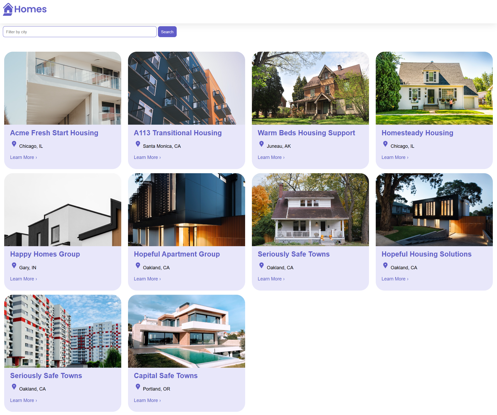

# <p align="center">🏡 Angular Homes App</p>

## 🚀 General info

The repository contains an Angular application created as part of a tutorial from the official Angular documentation.



## 🛠️ Getting Started

### Step 1: 🅰️ Install Angular if you don't have it installed

```
npm install -g @angular/cli
```

### Step 2: ⚙️ Install the dependencies

```
npm install
```

### Step 3: 🏃‍♂️ Run the application

```
ng serve
```

```
json-server --watch db.json
```

## 📧 Contact

- Email: [karolina.anna.jesionek@gmail.com](mailto:karolina.anna.jesionek@gmail.com)
- LinkedIn: [Karolina Jesionek - Junior Frontend Developer](https://www.linkedin.com/in/karolina-jesionek-frontend-developer/)
